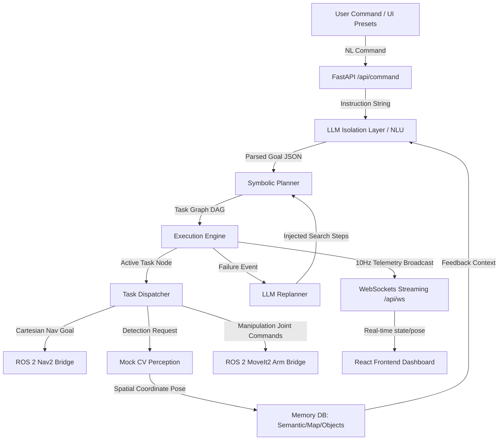

# Robotics Task Planning Framework (ROS 2 Integrated)

A production-quality robotics task planning framework. It takes natural language user commands (e.g. `"Bring me a glass of water."`), translates them into structured action nodes, parses dependency paths, executes them step-by-step using a mock/real ROS 2 bridge (Navigation2, MoveIt2, tf2, sensors), and broadcasts state updates to a React TypeScript dashboard.

The framework supports **dynamic replanning** via LLM failure recovery. If a target object is missing (e.g. glass not found on the kitchen countertop), the system automatically queries semantic memory and LLM contexts to inject recovery steps (e.g. searching the sink and cupboard) before resuming execution.

### 🌐 Live Production Link
You can access the live deployed dashboard on Render here:  
**[Robotics Task Planner Dashboard (Live)](https://samsung-frontend.onrender.com/)**

---

## Overall Architecture



### Modular Components

1. **Natural Language Understanding (`backend/agents/llm_layer.py`)**: Converts instruction strings to structured intents. Isolates prompt engineering behind standard service interfaces.
2. **Symbolic Planner (`backend/planner/planner.py`)**: Compiles parsed intents into hierarchical task graphs with explicit dependencies.
3. **Execution Engine (`backend/execution/engine.py`)**: Traverses the task graph topologically. Tracks states (`PENDING`, `RUNNING`, `SUCCESS`, `FAILED`, `RETRY`). Integrates timeouts and error boundary recovery.
4. **ROS 2 Bridge (`backend/ros2_bridge/`)**: SWAP-ready client interfacing with Nav2 action clients, MoveIt2 planning pipelines, and tf2 transforms. Integrates high-fidelity kinematic, telemetry, and topic simulations for local environments without ROS 2 binaries.
5. **Perception (`backend/perception/perception.py`)**: Exposes interfaces for 2D/3D CV object bounding boxes and camera matrices.
6. **Memory (`backend/memory/memory.py`)**: Persistent catalog representing rooms, spatial coordinates, containment relationships (semantic facts), and historical execution runs.
7. **Frontend Dashboard (`frontend/`)**: Sleek, monochrome dark theme React application rendering plan states, diagnostic meters, real-time logging, and interactive coordinate navigation paths.

---

## Local Development Setup

### System Prerequisites
- Python 3.11+
- Node.js v20+ & npm

### Backend Installation
1. Move to workspace root:
   ```bash
   cd jasveer
   ```
2. Create and activate a Python virtual environment:
   ```bash
   python -m venv venv
   # On Windows:
   .\venv\Scripts\activate
   # On Unix/macOS:
   source venv/bin/activate
   ```
3. Install dependencies:
   ```bash
   pip install -r backend/requirements.txt
   pip install pytest-asyncio
   ```
4. Start the FastAPI backend server:
   ```bash
   python backend/main.py
   ```
   The API will run at `http://localhost:8000`.

### Frontend Installation
1. Navigate to the frontend directory:
   ```bash
   cd frontend
   ```
2. Install npm packages:
   ```bash
   npm install
   ```
3. Launch Vite development dev server:
   ```bash
   npm run dev
   ```
   The dashboard will run at `http://localhost:5173`.

### Running Tests
Execute the pytest suite from the workspace root:
```bash
python -m pytest
```

---

## Running with Docker Compose

To spin up the entire production-ready ecosystem inside isolated Docker containers:

1. Build and boot containers:
   ```bash
   docker-compose up --build
   ```
2. Access the applications:
   - **Frontend Dashboard**: `http://localhost`
   - **FastAPI Core**: `http://localhost:8000`

---

## Demonstration Cases

Open the dashboard and trigger one of the preset command buttons to see it run:

1. **"Bring me a glass of water."**:
   - Compiles a 9-step hierarchical plan.
   - Triggers Nav2 navigation to the kitchen countertop.
   - Attempts object detection (simulating initial countertop failure because the glass is in the sink).
   - Triggers the LLM replanner, injecting recovery actions: Navigating to cupboard, scanning, Navigating to sink, and scanning.
   - Successfully localizes the glass in the sink, updates spatial coordinate memory, executes MoveIt2 arm grip movements, navigate back to user, and verify.
2. **"Pick up the red bottle."**:
   - Locates red bottle in office room.
   - Navigates, runs CV scans, plans joint gripper trajectories, and lifts the item.
3. **"Go to the kitchen and return."**:
   - Navigation cycle returning to origin.
